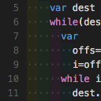

# vscode-setup
Preference setting for vscode

## Extensions

| ALL EXTENSION |  |
|:-:|:-:|
|   | [BetterCPP](https://marketplace.visualstudio.com/items?itemName=jeff-hykin.better-cpp-syntax)  |
|   | [GithubCopilot](https://marketplace.visualstudio.com/items?itemName=GitHub.copilot)  |
|   | [c#](https://marketplace.visualstudio.com/items?itemName=ms-dotnettools.csharp)  |
|   | [DotENV](https://marketplace.visualstudio.com/items?itemName=mikestead.dotenv)  |
|   | [gitHistory](https://marketplace.visualstudio.com/items?itemName=donjayamanne.githistory)  |
|   | [gitLens](https://marketplace.visualstudio.com/items?itemName=eamodio.gitlens)  |
|   | [liveServer](https://marketplace.visualstudio.com/items?itemName=yandeu.five-server)  |
|   | [materialIcon](https://marketplace.visualstudio.com/items?itemName=PKief.material-icon-theme)  |
|   | [npmIntel](https://marketplace.visualstudio.com/items?itemName=christian-kohler.npm-intellisense)  |
|   | [oneDarkPro](https://marketplace.visualstudio.com/items?itemName=zhuangtongfa.Material-theme)  |
|   | [pathIntel](https://marketplace.visualstudio.com/items?itemName=christian-kohler.path-intellisense)  |
|   | [phpItelephense](https://marketplace.visualstudio.com/items?itemName=bmewburn.vscode-intelephense-client)  |
|   | [prettier](https://marketplace.visualstudio.com/items?itemName=esbenp.prettier-vscode)  |
|   | [rainbowIndent](https://marketplace.visualstudio.com/items?itemName=oderwat.indent-rainbow)  |
|   | [spellChecker](https://marketplace.visualstudio.com/items?itemName=streetsidesoftware.code-spell-checker)  |
|   | [standardJS](https://marketplace.visualstudio.com/items?itemName=standard.vscode-standard)  |
|   | [thunderClint](https://marketplace.visualstudio.com/items?itemName=rangav.vscode-thunder-client)  |
|   | [vsIntelliCode](https://marketplace.visualstudio.com/items?itemName=VisualStudioExptTeam.vscodeintellicode)  |